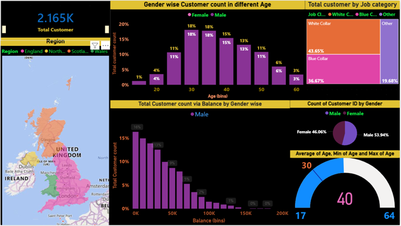

# Customer Analytics Power BI Dashboard

## Brief One-Line Summary
Interactive Power BI dashboard analyzing customer demographics and financial behavior to support data-driven customer segmentation and business decisions.

## 📌 Table of Contents
- <a href="#overview">Overview</a>
- <a href="#business-problem">Problem Statement</a>
- <a href="#dataset">Dataset</a>
- <a href="#tools--technologies">Tools & Technologies</a>
- <a href="#project-structure">Project Structure</a>
- <a href="#data-cleaning--preparation">Data Cleaning & Preparation</a>
- <a href="#exploratory-data-analysis-eda">Exploratory Data Analysis (EDA)</a>
- <a href="#research-questions--key-findings">Research Questions & Key Findings</a>
- <a href="#dashboard">Dashboard</a>
- <a href="#how-to-run-this-project">How to Run This Project</a>
- <a href="#final-recommendations">Final Recommendations</a>
- <a href="#author--contact">Author & Contact</a>

<h2>Overview</h2>

## Overview
This project showcases a Power BI dashboard built on a dataset of 5,000 customer records. The objective is to analyze demographic, geographic, and financial attributes and segment customers using meaningful business dimensions.

## Problem Statement
Organizations often struggle to understand customer distribution, value segments, and demographic patterns. This project aims to convert raw customer data into actionable insights for better customer targeting and strategic planning.

## Dataset
- 5,000 customer records
- Attributes include:
  - Age
  - Gender
  - Region
  - Job Classification
  - Account Balance
- Derived fields:
  - Age bins
  - Balance bands

## Tools and Technologies
- Power BI
- Microsoft Excel / CSV
- Data Modeling and DAX (basic measures)

## Methods
- Data cleaning and preparation
- Creation of age and balance bins
- Interactive slicers and filters
- KPI and segmentation visuals

## Key Insights
- Identification of high-value customer segments
- Balance distribution across age groups
- Regional and job-based customer concentration
- Demographic trends impacting customer value

## Dashboard Output

### Overview Dashboard

### Customer Segmentation
Gender wise Female

Gender wise Male

### Filters and Drill-Down

## How to View This Project
1. Review dashboard screenshots above
2. Interact with visuals conceptually via filters shown
3. Power BI file not shared due to size/privacy constraints

## Results and Conclusion
The dashboard provides clear visibility into customer segments, enabling better business decisions related to customer engagement, targeting, and value optimization.

## Future Work
- Add churn or profitability metrics
- Integrate time-based trends
- Deploy dashboard via Power BI Service

## Author and Contact
**Navanath Ghule**  
Business Excellence | Analytics | Power BI  
GitHub: https://github.com/navaghule15
