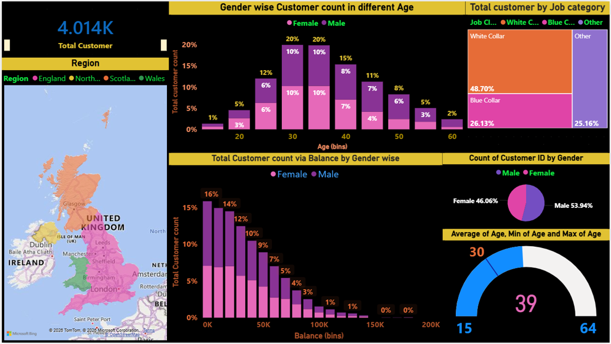
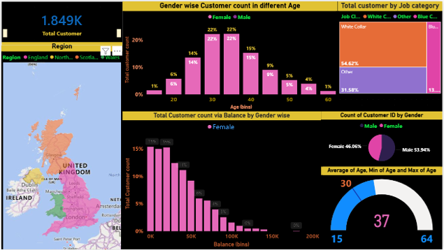
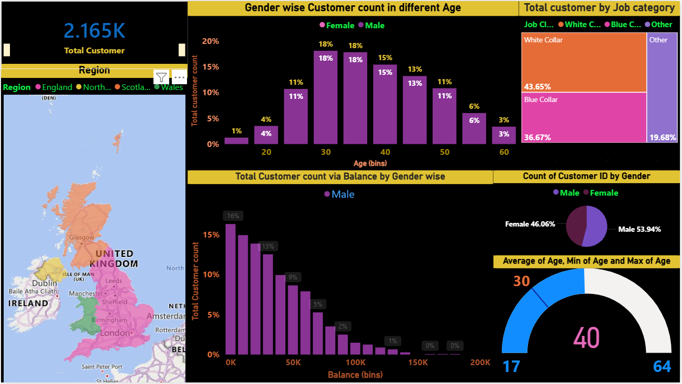

# Customer Analytics Power BI Dashboard

## Brief One-Line Summary
Interactive Power BI dashboard analyzing customer demographics and financial behavior to support data-driven customer segmentation and business decisions.

## 📌 Table of Contents
- <a href="#overview">Overview</a>
- <a href="#Problem-statement">Problem-statement</a>
- <a href="#dataset">Dataset</a>
- <a href="#Tools--Technologies">Tools & Technologies</a>
- <a href="#Methods">Methods</a>
- <a href="#Key-Insights">Key Insights</a>
- <a href="#Overview-Dashboard">Overview Dashboard</a>
- <a href="#Customer-Segmentation">Customer Segmentation</a>
- <a href="#how-to-view-this-project">How to View This Project</a>
- <a href="#Results--Conclusion">Results & Conclusion</a>
- <a href="#how-to-run-this-project">How to Run This Project</a>
- <a href="#final-recommendations">Final Recommendations</a>
- <a href="#author--contact">Author & Contact</a>

<h2>Overview</h2>

This project showcases a Power BI dashboard built on a dataset of 5,000 customer records. The objective is to analyze demographic, geographic, and financial attributes and segment customers using meaningful business dimensions.

<h2>Problem-Statement</h2>

Organizations often struggle to understand customer distribution, value segments, and demographic patterns. This project aims to convert raw customer data into actionable insights for better customer targeting and strategic planning.

<h2>Dataset</h2>
- 5,000 customer records
- Attributes include:
  - Age
  - Gender
  - Region
  - Job Classification
  - Account Balance
- Derived fields:
  - Age bins
  - Balance bands

<h2>Tools & Technologies</h2> 
- Power BI
- Microsoft Excel / CSV
- Data Modeling and DAX (basic measures)

<h2>Methods</h2>
- Data cleaning and preparation
- Creation of age and balance bins
- Interactive slicers and filters
- KPI and segmentation visuals

<h2>Key Insights</h2>
- Identification of high-value customer segments
- Balance distribution across age groups
- Regional and job-based customer concentration
- Demographic trends impacting customer value

## Dashboard Output

<h2>Overview Dashboard</h2>
      

<h2>Customer Segmentation</h2>
Gender wise Female

Gender wise Male

### Filters and Drill-Down

<h2>How to View This Project</h2>
1. Review dashboard screenshots above
2. Interact with visuals conceptually via filters shown
3. Power BI file not shared due to size/privacy constraints

<h2>Results & Conclusion</h2>
The dashboard provides clear visibility into customer segments, enabling better business decisions related to customer engagement, targeting, and value optimization.

## Future Work
- Add churn or profitability metrics
- Integrate time-based trends
- Deploy dashboard via Power BI Service

## Author and Contact
**Navanath Ghule**  
Business Excellence | Analytics | Power BI  
GitHub: https://github.com/navaghule15
